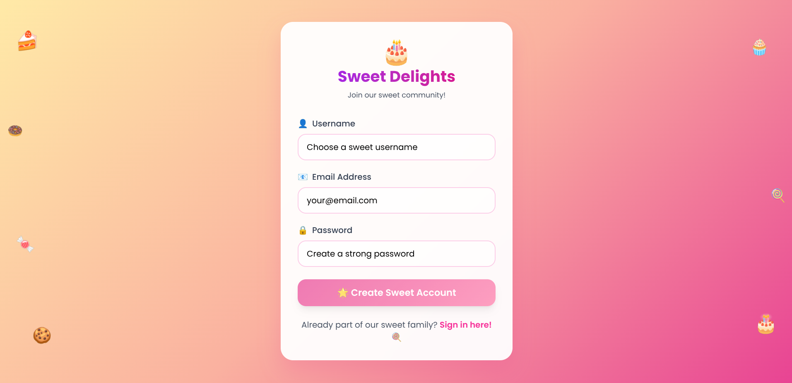
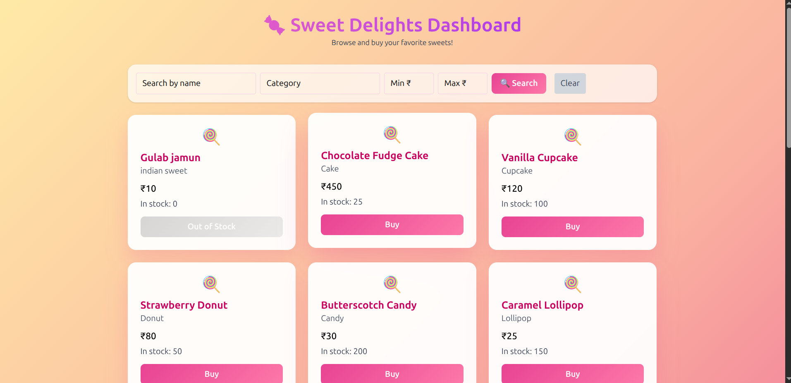
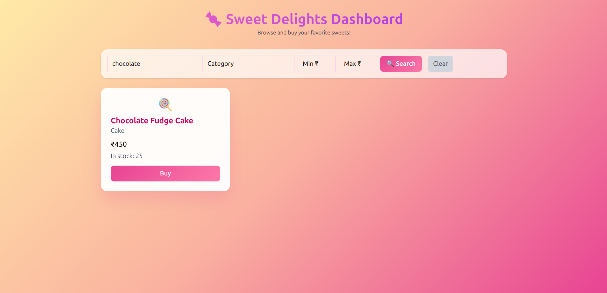

# 🍬 Sweet Delights - E-commerce Application

A full-stack e-commerce application for a sweet shop built with Angular (frontend) and FastAPI (backend). Users can browse sweets, make purchases, and admins can manage the inventory through a dedicated admin panel.

## 📸 Screenshots

| Feature | Screenshot |
|---------|------------|
| **User Registration** |  |
| **Login (User/Admin)** | .png) |
| **Dashboard & Shopping** |  |
| **Search & Filter** |  |

## 🚀 Features

### 👤 User Features
- **User Registration & Authentication** - Secure user account creation and login
- **Product Browsing** - View all available sweets with details (name, category, price, stock)
- **Advanced Search & Filtering** - Search by name, category, and price range
- **Purchase System** - Buy sweets with real-time stock updates
- **Responsive Design** - Beautiful, mobile-friendly interface with candy-themed UI

### 👑 Admin Features
- **Admin Authentication** - Separate admin login with privilege verification
- **Inventory Management** - Add, update, and manage sweet products
- **User Management** - View and manage user accounts
- **Sales Analytics** - Track purchases and inventory levels

### 🔒 Security Features
- **JWT Authentication** - Secure token-based authentication
- **Password Hashing** - Bcrypt password encryption
- **Role-based Access Control** - Admin vs regular user permissions
- **Input Validation** - Comprehensive data validation on both frontend and backend

## 🛠 Technology Stack

### Frontend (Angular 18)
- **Framework**: Angular 18 with Standalone Components
- **Styling**: Tailwind CSS with custom candy-themed design
- **Forms**: Angular Reactive Forms with validation
- **HTTP Client**: Angular HttpClient for API communication
- **Routing**: Angular Router with navigation guards
- **Testing**: Jasmine & Karma with comprehensive test coverage

### Backend (FastAPI)
- **Framework**: FastAPI (Python)
- **Database**: SQLite with SQLModel ORM
- **Authentication**: JWT tokens with OAuth2 password bearer
- **Password Security**: Bcrypt hashing
- **API Documentation**: Auto-generated Swagger/OpenAPI docs
- **Validation**: Pydantic models for request/response validation

## 📋 Prerequisites

- **Node.js** (v18 or higher)
- **npm** (v9 or higher)
- **Python** (v3.8 or higher)
- **pip** (Python package manager)

## ⚙️ Installation & Setup

### Backend Setup

1. **Clone the repository**
   ```bash
   git clone <repository-url>
   cd sweet-delights
   ```

2. **Create virtual environment**
   ```bash
   python -m venv venv
   source venv/bin/activate  # On Windows: venv\Scripts\activate
   ```

3. **Install Python dependencies**
   ```bash
   pip install fastapi uvicorn sqlmodel bcrypt python-jose python-multipart
   ```

4. **Run the backend server**
   ```bash
   uvicorn main:app --reload --port 8000
   ```

   The backend will be available at `http://localhost:8000`

5. **View API Documentation**
   - Swagger UI: `http://localhost:8000/docs`
   - ReDoc: `http://localhost:8000/redoc`

### Frontend Setup

1. **Navigate to the frontend directory**
   ```bash
   cd frontend  # Adjust path as needed
   ```

2. **Install Node.js dependencies**
   ```bash
   npm install
   ```

3. **Run the Angular development server**
   ```bash
   ng serve
   ```

   The frontend will be available at `http://localhost:4200`

## 🗄️ Database Schema

### User Model
```python
class User(SQLModel, table=True):
    id: Optional[int] = Field(default=None, primary_key=True)
    username: str = Field(unique=True)
    email: str = Field(unique=True)
    hashed_password: str
    is_admin: bool = Field(default=False)
    created_at: datetime = Field(default_factory=datetime.utcnow)
```

### Sweet Model
```python
class Sweet(SQLModel, table=True):
    id: Optional[int] = Field(default=None, primary_key=True)
    name: str
    category: str
    price: float
    quantity: int
    description: Optional[str] = None
    created_at: datetime = Field(default_factory=datetime.utcnow)
```

## 🔗 API Endpoints

### Authentication
- `POST /api/auth/register` - User registration
- `POST /api/auth/login` - Regular user login
- `POST /api/auth/admin-login` - Admin login with privilege check

### Sweets Management
- `GET /api/sweets` - Get all sweets
- `GET /api/sweets/search` - Search sweets with filters
- `POST /api/sweets/{id}/purchase` - Purchase a sweet
- `POST /api/sweets` - Create new sweet (Admin only)
- `PUT /api/sweets/{id}` - Update sweet (Admin only)
- `DELETE /api/sweets/{id}` - Delete sweet (Admin only)

## 🧪 Testing

### Frontend Testing
```bash
# Run unit tests
ng test

# Run tests with coverage
ng test --code-coverage

# Run e2e tests
ng e2e
```

### Backend Testing
```bash
# Run tests with pytest
pytest

# Run with coverage
pytest --cov=.
```

## 🚦 Running in Production

### Backend (FastAPI)
```bash
# Install production dependencies
pip install gunicorn

# Run with Gunicorn
gunicorn main:app -w 4 -k uvicorn.workers.UvicornWorker --bind 0.0.0.0:8000
```

### Frontend (Angular)
```bash
# Build for production
ng build --prod

# Serve built files (example with serve)
npm install -g serve
serve -s dist/sweet-delights
```

## 🔐 Environment Configuration

### Backend Environment Variables
Create a `.env` file in the backend root:
```env
SECRET_KEY=your-super-secret-key-here
ADMIN_REGISTER_SECRET=admin-secret-code
DATABASE_URL=sqlite:///./sweet_delights.db
```

### Frontend Environment
Update `src/environments/environment.ts`:
```typescript
export const environment = {
  production: false,
  apiUrl: 'http://localhost:8000'
};
```

## 📁 Project Structure

```
sweet-delights/
├── backend/
│   ├── main.py                 # FastAPI application entry point
│   ├── models/                 # SQLModel database models
│   ├── schemas/                # Pydantic schemas
│   ├── auth/                   # Authentication utilities
│   ├── database.py             # Database configuration
│   └── main.py                 # Main API 
|   └── requirements.txt        # Python dependencies
├── frontend/
│   ├── src/
│   │   ├── app/
│   │   │   ├── pages/          # Page components
│   │   │   │   ├── login/
│   │   │   │   ├── register/
│   │   │   │   ├── dashboard/
│   │   │   │   └── admin/
│   │   │   ├── shared/         # Shared components
│   │   │   └── app.component.ts
│   │   ├── environments/       # Environment configurations
│   │   └── styles.css          # Global styles
│   ├── package.json
│   └── angular.json
├── images/                     # Screenshots
│   ├── Register.png
│   ├── Login(user or admin).png
│   ├── Dashboard.png
│   └── Search.png
└── README.md
```

## 🤝 Contributing

1. Fork the repository
2. Create a feature branch (`git checkout -b feature/amazing-feature`)
3. Commit your changes (`git commit -m 'Add some amazing feature'`)
4. Push to the branch (`git push origin feature/amazing-feature`)
5. Open a Pull Request

## 📄 License

This project is licensed under the MIT License - see the [LICENSE](LICENSE) file for details.

## 🆘 Troubleshooting

### Common Issues

1. **Backend won't start**
   - Ensure Python virtual environment is activated
   - Check if port 8000 is available
   - Verify all dependencies are installed

2. **Frontend can't connect to backend**
   - Ensure backend is running on port 8000
   - Check CORS configuration in FastAPI
   - Verify API URLs in environment files

3. **Database issues**
   - Delete existing database file and restart backend to recreate
   - Check database permissions
   - Ensure SQLite is properly installed

4. **Authentication problems**
   - Check JWT secret key configuration
   - Verify token expiration settings
   - Clear browser localStorage if needed

## 📞 Support

If you encounter any issues or have questions, please:
1. Check the troubleshooting section above
2. Search existing issues in the repository
3. Create a new issue with detailed information about the problem

---

**Happy Sweet Shopping!** 🍭🍰🧁